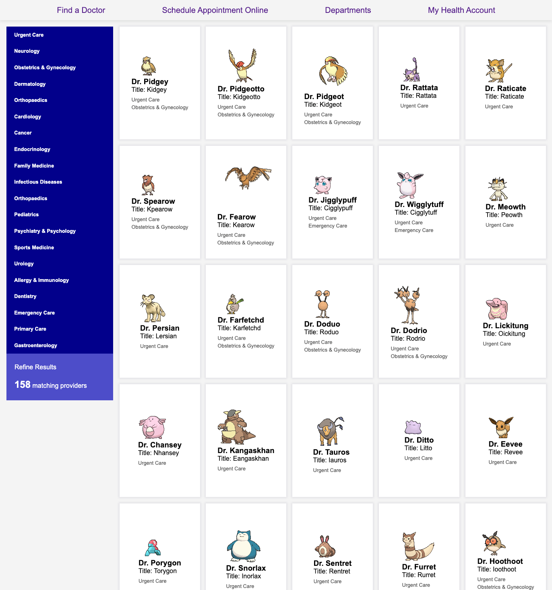
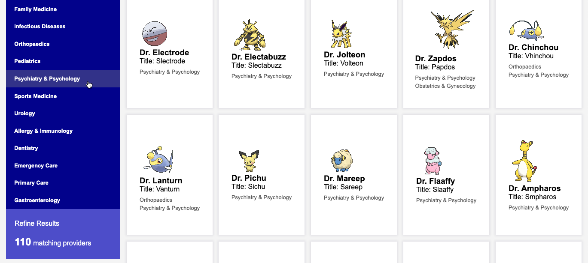
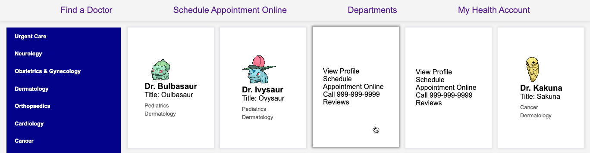

# MedFinder: React Doctor Search Engine

## Description

MedFinder, a React Doctor Search Engine, is a web application built with React that allows users to search and browse a directory of doctors and healthcare providers. Users can refine their search results based on various criteria and view detailed information about each provider.

The application features flip cards, allowing users to interactively view detailed information about each provider. Users can click on a card to flip it and see additional details.

## Table of Contents

- [Features](#features)
- [Technologies Used](#technologies-used)
- [Installation](#installation)
- [Usage](#usage)

## Features

- Display list of doctors/providers.
- Search and refine results.
- View detailed information for each provider.
- Additional features (if any).

## Technologies Used

- **React**: Frontend library for building user interfaces.
- **JavaScript (ES6+)**: Programming language used for the frontend logic.
- **HTML/CSS**: Markup and styling languages for structuring and designing the UI.
- **Axios**: Promise-based HTTP client for making API requests.
- **React Router**: Declarative routing for React applications.

## Approach

The approach taken in developing React Doctor Directory involved the following steps:

1. **Planning**: Read and understand the requirements of SBA 320H - React Web Application Project and define the scope of the project.
2. **Design**: Create wireframes and UI mockups to visualize the layout and structure.
3. **Development**: Implement the frontend logic using React components, fetching data from an API, and style the UI with CSS.
4. **Testing**: Conduct thorough testing to ensure functionality and usability across different devices and browsers.
5. **Deployment**: Deploy the application to a hosting platform to make it accessible to users.

## Live Site

You can access the live site here:

## Installation

To run this project locally, follow these steps:

1. Clone the repository to your local machine: `git clone https://github.com/yivvm/Project-React-Doctorlist.git`
2. Navigate to the project directory: `cd Project-React-Doctorlist`
3. Install dependencies: `npm install`
4. Start the development server: `npm start`
5. Open the web browser and go to `http://localhost:5173` to view the application.

## Usage

Once the application is running, users can:

- Browse the list of doctors/providers.
- Refine search results.
- View detailed information about each provider.
- Interact with additional features: the flip cards, allowing users to interactively view detailed information about each provider. Users can click on a card to flip it and see additional details.

## Sreenshots of the application

- Refine the results by clicking on different departments:
  

- Flip cards:
  
